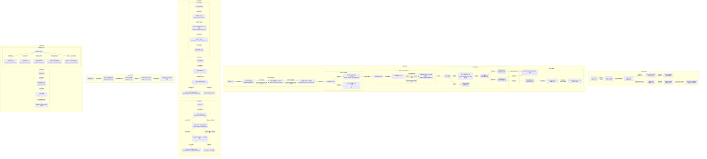

```mermaid
graph TD;

    subgraph "销售管理流程"
        sale_order("sale_order<br>销售订单主表") -->|外键关联<br>sale_no| sale_order_detail("sale_order_detail<br>销售订单明细表");
        sale_order_detail -->|根据业务逻辑触发| sale_delivery_order("sale_delivery_order<br>销售发货主表");
        sale_delivery_order -->|外键关联<br>delivery_no| sale_delivery_product("sale_delivery_product<br>销售发货产品表");
        sale_delivery_product -->|外键关联<br>id_father| sale_delivery_detail("sale_delivery_detail<br>销售发货明细表");
        sale_delivery_order -->|根据业务逻辑可能关联| sales_return("sales_return<br>销售退货主表");
        sales_return -->|外键关联<br>return_no| sales_return_detail("sales_return_detail<br>销售退货详情表");
        sales_return_detail -->|根据业务逻辑关联细化| sales_return_detail_detail("sales_return_detail_detail<br>销售退货详情-明细表");
    end

    subgraph "采购管理流程"
        subgraph "采购订单创建阶段"
            POCreateStart("采购需求产生") -->|发起采购流程| POMainCreate("填写采购订单主表<br>storage_purchase_order")
            POMainCreate -->|关联产品信息| POProductInfo("添加采购订单副表（产品信息）<br>storage_purchase_order_product")
            POProductInfo -->|完善产品详细数据| POProductDetail("完善采购订单副表（详细信息）<br>storage_purchase_order_product_detail")
        end

        subgraph "采购订单审核阶段"
            POProductDetail -->|提交审核| POAudit("提交采购订单审核")
            POAudit -->|审核通过| POApproved("更新主表状态为审核通过<br>修改storage_purchase_order.order_status")
            POAudit -->|审核拒绝| PORefused("记录未通过原因到主表<br>更新storage_purchase_order.notpass_reason等")
        end

        subgraph "采购执行与收货准备阶段"
            POApproved -->|通知供应商发货| SupplierDelivery("供应商按订单发货")
            SupplierDelivery -->|货物即将到达| PRCreate("创建采购收货主表<br>storage_purchase_receive")
            PRCreate -->|关联采购产品明细| PRDetailCreate("添加采购收货副表（对应采购产品详情）<br>storage_purchase_receive_detail")
        end

        subgraph "收货处理阶段"
            PRDetailCreate -->|收货时| QuantityCheck("核对收货数量")
            QuantityCheck -->|数量相符| QuantityMatch("更新已收货数量等字段<br>在storage_purchase_receive_detail中操作")
            QuantityCheck -->|数量不符| QuantityMismatch("记录差异并沟通协调<br>发起处理流程")
            QuantityMatch -->|送去质检| QualityInspection("进行质检流程<br>更新质检状态字段")
            QualityInspection -->|质检合格| QualityPass("办理入库手续<br>更新入库相关字段")
            QualityInspection -->|质检不合格| QualityFail("判断特采或退货<br>更新对应状态及字段")
        end

        subgraph "后续处理阶段"
            QualityPass -->|全部产品入库完成| PurchaseComplete("更新采购订单主表状态为采购完成<br>修改storage_purchase_order.order_status")
            QualityFail -->|选择特采| PurchaseComplete
            QualityFail -->|选择退货| ReturnHandle("记录退货数量等信息<br>更新相关表对应字段")
            ReturnHandle -->|关联退货单号| storage_purchase_return("storage_purchase_return<br>采购退货主表")
            storage_purchase_return -->|外键关联<br>return_orderno| storage_purchase_return_detail("storage_purchase_return_detail<br>采购退货详情表")
        end

        POMainCreate -->|通过purchase_orderno外键关联| POProductInfo
        POProductInfo -->|通过purchase_orderno外键关联| POProductDetail
        PRCreate -->|通过purchase_orderno外键关联| PRDetailCreate
        PRDetailCreate -->|通过receive_orderno外键关联| PRCreate
    end 

    subgraph "生产管理流程"
        subgraph "生产领料阶段"
            ProductionRequisitionCreate("生产需求产生") -->|发起领料流程| StorageProductionRequisitionCreate("创建生产领料主表<br>storage_production_requisition")
            StorageProductionRequisitionCreate -->|关联生产计划| StorageProductionRequisitionPlanCreate("添加生产计划（生产领料副表）<br>storage_production_requisition_plan")
            StorageProductionRequisitionPlanCreate -->|细化领料信息| StorageProductionRequisitionDetailCreate("创建领料单详情信息（生产领料详情表）<br>storage_production_requisition_detail")
            StorageProductionRequisitionDetailCreate -->|进一步明细| StorageProductionRequisitionDetailDetailCreate("创建领料单详情信息-领料明细表<br>storage_production_requisition_detail_detail")
            StorageProductionRequisitionDetailCreate -->|领料操作| RequisitionTake("执行领料操作，更新状态等")
        end

        subgraph "生产退料阶段"
            ProductionReturnCreate("产生退料需求") -->|发起退料流程| StorageProductionReturnProCreate("创建生产退料主表<br>storage_production_return_pro")
            StorageProductionReturnProCreate -->|关联退料产品信息| StorageProductionReturnProDetailCreate("添加生产退料 详细信息<br>storage_production_return_pro_detail")
            StorageProductionReturnProDetailCreate -->|退料明细记录| StorageProductionReturnProDetailDetailCreate("创建生产退料详情 -退料料明细表<br>storage_production_return_pro_detail_detail")
            StorageProductionReturnProDetailCreate -->|执行退料操作| ReturnProHandle("更新相关状态及库存信息等")
        end

        subgraph "生产入库阶段"
            ProductionInhouseCreate("生产完成准备入库") -->|发起入库流程| StorageProductionInhouseCreate("创建生产入库主表<br>storage_production_inhouse")
            StorageProductionInhouseCreate -->|关联入库产品信息| StorageProductionInhousePlanCreate("添加计划工单产品或者非计划工单产品<br>storage_production_inhouse_plan")
            StorageProductionInhousePlanCreate -->|入库产品明细| StorageProductionInhousePlanDetailCreate("创建入库产品详情<br>storage_production_inhouse_plan_detail")
            StorageProductionInhousePlanDetailCreate -->|执行入库操作| InhouseHandle("更新库存等相关信息")
        end

        StorageProductionRequisitionCreate -->|通过pr_no外键关联| StorageProductionRequisitionPlanCreate
        StorageProductionRequisitionPlanCreate -->|通过plan_no和pr_no外键关联| StorageProductionRequisitionDetailCreate
    end

    subgraph "车间调拨流程"
        TransferOrderCreate("调拨需求产生") -->|发起调拨流程| StorageTransferOrderCreate("创建车间调拨基础信息<br>storage_transfer_order")
        StorageTransferOrderCreate -->|关联调拨物料信息| StorageCarAllotCreate("添加车间调拨物料<br>storage_car_allot")
        StorageCarAllotCreate -->|明细记录| StorageCarAllotDetailCreate("创建车间调拨-调入明细<br>storage_car_allot_detail")
        StorageCarAllotDetailCreate -->|执行调拨操作| AllotHandle("更新调出和调入仓库库存等信息")
    end

    subgraph "库存管理流程"
        subgraph "库存盘点流程"
            StockTaskCreate("发起盘点任务") -->|创建盘点任务| StorageStockTaskCreate("创建盘点任务表<br>storage_stock_task")
            StorageStockTaskCreate -->|关联盘点明细| StorageStockTaskDetailCreate("创建盘点明细<br>storage_stock_task_detail")
            StorageStockTaskDetailCreate -->|盘点操作及结果处理| StockHandle("根据盘点结果更新库存等相关信息")
        end

        subgraph "库存查询与展示"
            QueryRequest("发起库存查询请求") -->|查询库存总览| StorageInventoryOverviewQuery("查询库存总览表<br>storage_inventory_overview")
            QueryRequest -->|查询库存明细| StorageInventoryDetailQuery("查询库存明细<br>storage_inventory_detail")
            QueryRequest -->|查询线边库明细| StorageWirelineStorageQuery("查询线边库明细<br>storage_wireline_storage")
            QueryRequest -->|查询月底结存信息| StorageInventoryDetailBalanceQuery("查询库存明细月底结存<br>storage_inventory_detail_Balance")
            QueryRequest -->|查询PCB库存月底结存| StorageInventoryPcbBalanceQuery("查询PCB库存明细月底结存<br>storage_inventory_pcb_balance")
        end

    end
```