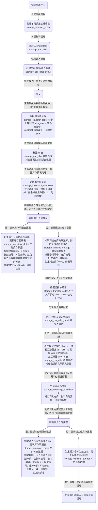

```mermaid
graph TD;

    %% 车间调拨流程整体开始
    TransferOrderCreate("调拨需求产生") -->|发起调拨流程| StorageTransferOrderCreate("创建车间调拨基础信息<br>storage_transfer_order")

    %% 关联调拨物料信息
    StorageTransferOrderCreate -->|关联物料信息| StorageCarAllotCreate("添加车间调拨物料<br>storage_car_allot")

    %% 记录调入明细相关操作
    StorageCarAllotCreate -->|记录调入明细| StorageCarAllotDetailCreate("创建车间调拨-调入明细<br>storage_car_allot_detail")

    %% 提交操作阶段，包含调拨中与已完成两个状态变化及对应库存等操作
    StorageCarAllotDetailCreate -->|提交操作，先进入调拨中状态| Submit("提交")
    Submit -->|更新调拨单状态为调拨中，同时处理相关数据| UpdateTransferOrderMid("根据调拨单号将 storage_transfer_order 表中入库状态 allot_status 改为调拨中，<br>并填写实际调拨人、调拨日期等")
    UpdateTransferOrderMid -->|修改调出物料实际调出数量| UpdateActualOutQty("根据 id 去 storage_car_allot 表中修改对应数据的实际调出数量")
    UpdateActualOutQty -->|更新调出仓库库存总览，根据库存情况处理| UpdateOutInventoryOverview("更新库存总览表 storage_inventory_overview(<br>对应调出仓库，物料有则减掉，如果减完后数量<=0，则删除掉)")
    UpdateOutInventoryOverview -->|判断调出仓库是否为非线边库，进行不同库存明细更新| CheckOutWarehouseType("判断调出仓库类型")
    CheckOutWarehouseType -->|是，更新库存明细表数据| UpdateOutInventoryDetail("如果调出仓库为非线边库，<br>更新库存明细表 storage_inventory_detail 中的库存数据：<br>根据物料编号，仓库编号，货架编号，库位编号，批次号去库存明细表中减掉对应的库存，<br>如果减完后库存<=0，则删除掉")
    CheckOutWarehouseType -->|否，更新线边库库存数据| UpdateOutWirelineStorage("如果调出仓库为线边库，则更新线边库明细表 storage_wireline_storage 中的库存数据：<br>根据物料编号，仓库编号，批次号进行减库存，<br>如果减完库存<=0，则删除掉")

    %% 从调拨中状态过渡到已完成状态，继续后续操作
    UpdateOutWirelineStorage -->|操作完成，进入已完成状态| UpdateTransferOrderDone("根据调拨单号将 storage_transfer_order 表中入库状态 allot_status 改为已完成")
    UpdateTransferOrderDone -->|写入调入明细数据| WriteInDetail("向车间调拨-调入明细表 storage_car_allot_detail 中写入数据")
    WriteInDetail -->|汇总计算实际调入数量并更新| CalcAndUpdateInQty("通过写入数据的 allot_id，进行汇总得出每个 allot_id 的实际调入数据之和，<br>然后根据 allot_id 去 storage_car_allot 表中修改对应数据的实际调入数量")
    CalcAndUpdateInQty -->|更新调入仓库库存总览，根据库存情况处理| UpdateInInventoryOverview("更新库存总览表 storage_inventory_overview (<br>对应调入仓库，物料有则累加，没有则新增)")
    UpdateInInventoryOverview -->|判断调入仓库是否为非线边库，进行不同库存明细更新| CheckInWarehouseType("判断调入仓库类型")
    CheckInWarehouseType -->|是，更新库存明细表数据| UpdateInInventoryDetail("如果调入仓库为非线边库，<br>更新库存明细表 storage_inventory_detail 中的库存数据：<br>如果是同一天入库则入库日期一致，且物料编号，仓库编号，货架编号，库位编号，生产车间(可为空值)，批次号一致，则累加，<br>反之则新增")
    CheckInWarehouseType -->|否，更新线边库库存数据| UpdateInWirelineStorage("如果调入仓库为线边库，则更新线边库明细表 storage_wireline_storage 中的库存数据")

    %% 最终执行调拨，更新库存等信息
    UpdateInWirelineStorage -->|执行调拨，更新库存等相关信息| AllotHandle("更新调出和调入仓库库存等信息")
```