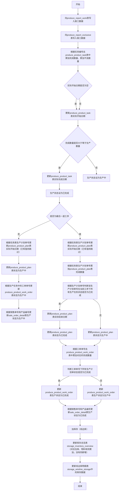

```mermaid
graph TD;
    A[开始] --> B[向produce_report_work表写入报工数据];
    B --> C[向produce_report_exclusive表写入报工数据];
    C --> D[根据任务编号去produce_product_task表中累加完成数量、累加不良数量];
    D --> E{实际开始日期是否为空};
    E -->|是| F[更新produce_product_task表实际开始日期];
    E -->|否| F;
    F --> G{完成数量是否大于等于生产数量};
    G -->|是| H[更新produce_product_task表实际完成日期];
    G -->|否| I[生产状态设为生产中];
    H --> J[生产状态设为已完成];
    J --> K{是否为最后一道工序};
    K -->|否| L[根据任务表生产计划单号更新produce_product_plan表实际开始日期（已有值则跳过）];
    L --> M[更新produce_product_plan表状态为生产中];
    M --> N[根据生产任务中的工单单号更新produce_product_work_order表状态为生产中];
    N --> O[根据销售单号和产品编号更新sale_order_detail表生产状态为生产中];
    K -->|是| P[根据任务表生产计划单号更新produce_product_plan表实际开始日期（已有值则跳过）];
    P --> Q[根据任务表生产计划单号累加produce_product_plan表完成数量];
    Q --> R[根据生产计划单号判断该生产计划单号在当前工序下所有生产任务状态是否为已完成];
    R -->|是| S[更新produce_product_plan表实际结束日期];
    S --> T[更新produce_product_plan表状态为已完成];
    R -->|否| U[更新produce_product_plan表状态为生产中];
    T --> V[根据工单单号去produce_product_work_order表中累加对应的完成数量];
    U --> V;
    V --> W[判断工单单号下所有生产计划单状态是否为已完成];
    W -->|是| X[更新produce_product_work_order表生产状态为已完成];
    W -->|否| Y[更新produce_product_work_order表生产状态为生产中];
    X --> Z[根据销售单号和产品编号更新sale_order_detail表生产状态为已完成];
    Y --> Z;
    Z --> AA[加库存（线边库）];
    AA --> AB[更新库存总览表storage_inventory_overview（对应仓库、物料有则累加，没有则新增）];
    AB --> AC[更新线边库明细表storage_wireline_storage中的库存数据];
    AC --> AD[结束]
```