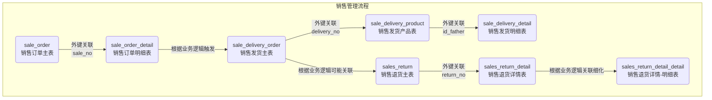

```mermaid
graph TD;

    subgraph "销售管理流程"
        sale_order("sale_order<br>销售订单主表") -->|外键关联<br>sale_no| sale_order_detail("sale_order_detail<br>销售订单明细表");
        sale_order_detail -->|根据业务逻辑触发| sale_delivery_order("sale_delivery_order<br>销售发货主表");
        sale_delivery_order -->|外键关联<br>delivery_no| sale_delivery_product("sale_delivery_product<br>销售发货产品表");
        sale_delivery_product -->|外键关联<br>id_father| sale_delivery_detail("sale_delivery_detail<br>销售发货明细表");
        sale_delivery_order -->|根据业务逻辑可能关联| sales_return("sales_return<br>销售退货主表");
        sales_return -->|外键关联<br>return_no| sales_return_detail("sales_return_detail<br>销售退货详情表");
        sales_return_detail -->|根据业务逻辑关联细化| sales_return_detail_detail("sales_return_detail_detail<br>销售退货详情-明细表");
    end

```