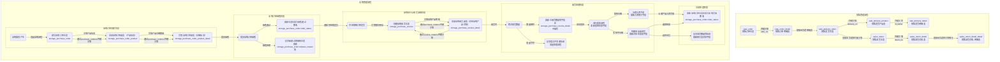

```mermaid
graph TD;

    subgraph "销售管理流程"
        sale_order("sale_order<br>销售订单主表") -->|外键关联<br>sale_no| sale_order_detail("sale_order_detail<br>销售订单明细表");
        sale_order_detail -->|根据业务逻辑触发| sale_delivery_order("sale_delivery_order<br>销售发货主表");
        sale_delivery_order -->|外键关联<br>delivery_no| sale_delivery_product("sale_delivery_product<br>销售发货产品表");
        sale_delivery_product -->|外键关联<br>id_father| sale_delivery_detail("sale_delivery_detail<br>销售发货明细表");
        sale_delivery_order -->|根据业务逻辑可能关联| sales_return("sales_return<br>销售退货主表");
        sales_return -->|外键关联<br>return_no| sales_return_detail("sales_return_detail<br>销售退货详情表");
        sales_return_detail -->|根据业务逻辑关联细化| sales_return_detail_detail("sales_return_detail_detail<br>销售退货详情-明细表");
    end

    subgraph "采购管理流程"
        subgraph "采购订单创建阶段"
            POCreateStart("采购需求产生") -->|发起采购流程| POMainCreate("填写采购订单主表<br>storage_purchase_order")
            POMainCreate -->|关联产品信息| POProductInfo("添加采购订单副表（产品信息）<br>storage_purchase_order_product")
            POProductInfo -->|完善产品详细数据| POProductDetail("完善采购订单副表（详细信息）<br>storage_purchase_order_product_detail")
        end

        subgraph "采购订单审核阶段"
            POProductDetail -->|提交审核| POAudit("提交采购订单审核")
            POAudit -->|审核通过| POApproved("更新主表状态为审核通过<br>修改storage_purchase_order.order_status")
            POAudit -->|审核拒绝| PORefused("记录未通过原因到主表<br>更新storage_purchase_order.notpass_reason等")
        end

        subgraph "采购执行与收货准备阶段"
            POApproved -->|通知供应商发货| SupplierDelivery("供应商按订单发货")
            SupplierDelivery -->|货物即将到达| PRCreate("创建采购收货主表<br>storage_purchase_receive")
            PRCreate -->|关联采购产品明细| PRDetailCreate("添加采购收货副表（对应采购产品详情）<br>storage_purchase_receive_detail")
        end

        subgraph "收货处理阶段"
            PRDetailCreate -->|收货时| QuantityCheck("核对收货数量")
            QuantityCheck -->|数量相符| QuantityMatch("更新已收货数量等字段<br>在storage_purchase_receive_detail中操作")
            QuantityCheck -->|数量不符| QuantityMismatch("记录差异并沟通协调<br>发起处理流程")
            QuantityMatch -->|送去质检| QualityInspection("进行质检流程<br>更新质检状态字段")
            QualityInspection -->|质检合格| QualityPass("办理入库手续<br>更新入库相关字段")
            QualityInspection -->|质检不合格| QualityFail("判断特采或退货<br>更新对应状态及字段")
        end

        subgraph "后续处理阶段"
            QualityPass -->|全部产品入库完成| PurchaseComplete("更新采购订单主表状态为采购完成<br>修改storage_purchase_order.order_status")
            QualityFail -->|选择特采| PurchaseComplete
            QualityFail -->|选择退货| ReturnHandle("记录退货数量等信息<br>更新相关表对应字段")
        end

        POMainCreate -->|通过purchase_orderno外键关联| POProductInfo
        POProductInfo -->|通过purchase_orderno外键关联| POProductDetail
        PRCreate -->|通过purchase_orderno外键关联| PRDetailCreate
        PRDetailCreate -->|通过receive_orderno外键关联| PRCreate
    end

```